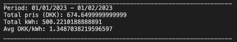
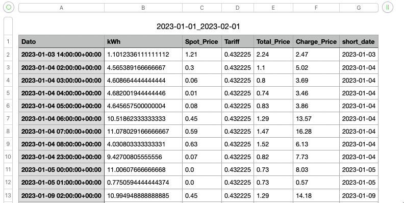

# Easee-API-Data

This code makes it possible to extract data from an Easee Home Electrical Vichicle Charger and Eloverblik.

The script will ask for a year and a month.

The output, when run in Visual Studio Code, looks like this:



## Setup

Create a file named `configuration.json` in the root folder of the project.

The files content should look like this:

```json
{
    "Easee": {
        "Username": "EASEE_HOME_USERNAME",
        "Password": "EASEE_HOME_PASSWORD",
        "ChargerName":"EASEE_HOME_CHARGER_NAME"

    },
    "Eloverblik": {
        "Token": "TOKEN_FROM_ELOVERBIK"
    }
}

```

Where EASEE_HOME_USERNAME and EASEE_HOME_PASSWORD is your login credentials to https://easee.cloud/auth/signin. These credentials are used to read your EV charges eletricity usage.

EASEE_HOME_CHARGER_NAME is the name of your charger found on the Easee Cloud Portal (https://easee.cloud/products).

TOKEN_FROM_ELOVERBIK is a token that can be required from https://eloverblik.dk/.
This token is responsible for reading the tariffs associated with your area.

## Running the script

This script was developed using Python 3.9.4.

### Run the following commands

Setup virtual environment:
`python -m venv venv`

Activate the environment:
`venv\bin\activate` (There are several activate files. Use the one the mathces your environment - eg. the ps1 file for PowerShell)

Install the requirements: `pip install -r requirements.txt`

Run the script using this command `python Easee-Script.py`.

Running the script will output the data in the console windows - and save the measurements to a .csv-file named `START-PERIOD_END-PERIOD.csv` eg. `2023-01-01_2023-02-01.csv`.

